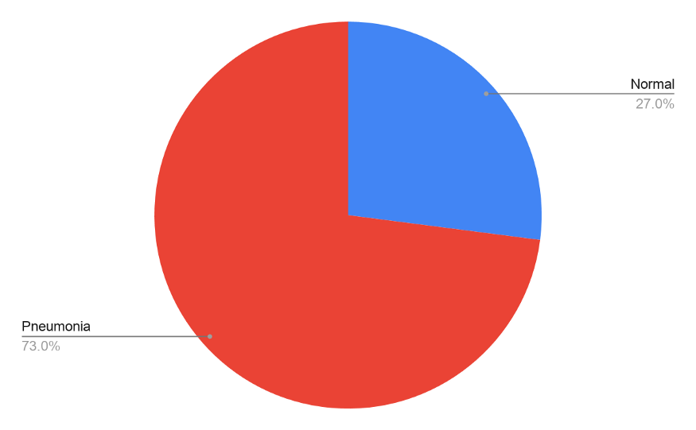
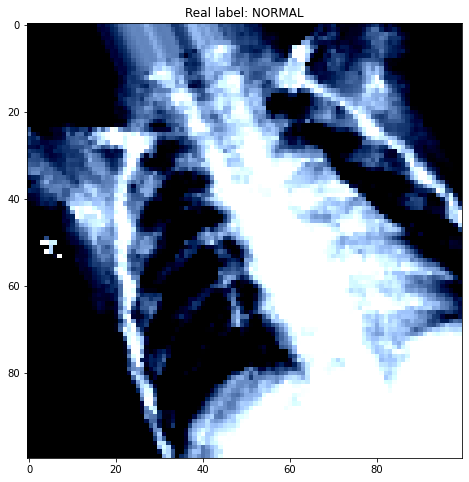
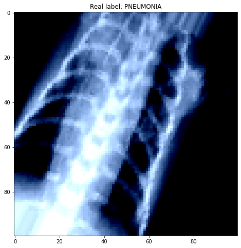
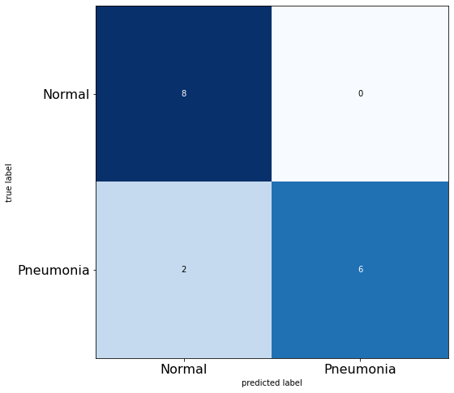
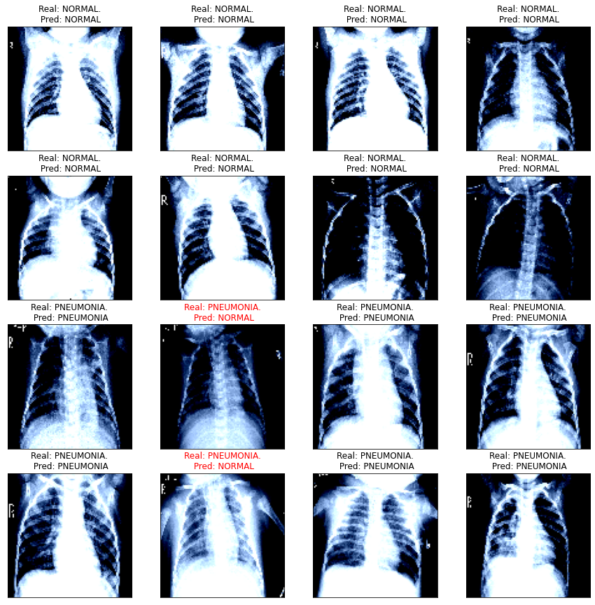
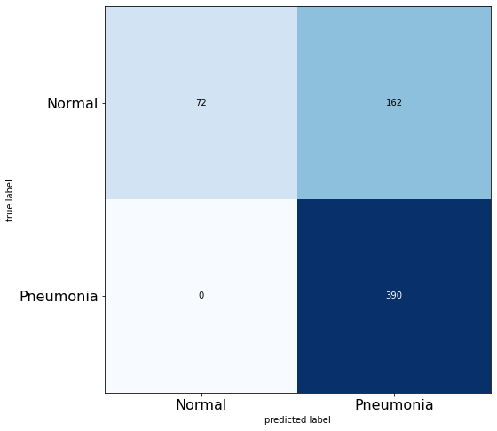

# Pneumonia Detection using Deep Learning.
* [Blog Link](https://medium.com/@saifkasmani84/pneumonia-detection-using-deep-learning-c60c0b264270)
* [Video Recording](PresentationVid/presvid.mp4)
* [Presentation](Presentation/presentation.pdf)

# Table Of Contents

* [Purpose](#purpose)
* [Business Case](#business-case)
* [Data Description](#data-description)
* [Data Preprocessing](#data-preprocessing)
* [Model](#models-used)
* [Results](#results)
* [Future Work](#future-work)
* [Conclusion](#conclusion)

## Purpose

Build a deep learning model that can classify whether a given patient has pneumonia, given a chest x-ray image.

## Business Case

Improve healthcare delivery and increase access to medical imaging expertise in parts of the world where access to skilled radiologists is limited.

## Why is this model important?

* Over 150 million people get infected with pneumonia on an annual basis especially children under 5 years old .
* In such regions, the problem can be further aggravated due to the lack of medical resources and personnel.
* For example, in Africa’s 57 nations, a gap of 2.3 million doctors and nurses exist. For these populations, accurate and fast diagnosis means everything. It can guarantee timely access to treatment and save much needed time and money for those already experiencing poverty.

## Data Description

In the data i was given, there are 5857 total images out of which Pneumonia cases account for 73%.

The data set can be found here: https://www.kaggle.com/paultimothymooney/chest-xray-pneumonia

## Data Preprocessing

All data was preprocessed on [this notebook](/Preprocessing.ipynb).
 
* Some images were in grayscale and majority of them were in 3-channels, hence converted all images to 3-channels.
* Normalize pixel values, resize all images to 224x224 size.
* Data Augmentation(imgaug): Generate samples of undersampled class to try and balance overall distribution.

## Models used

The following models were tried with this dataset:

* Convolutional Neural Network
* Transfer learning (VGG16 architechture)

## Results

Results of CNN Model:
Accuracy: 87.5 %
Precision: 75%
Recall: 100%
F1 score: 85%

Results of Transfer Learning — VGG16 Model:
Accuracy: 0.740385
Precision: 1.000000
Recall: 0.706522
F1 score: 0.828025

## Future Work

* If pneumonia detected, further classify if viral or bacterial pneumonia.
* Complete the flask production application for the model.
* Improve current model.
* Explore capsule network classification.
* Use deep learning for COVID-19 detection using Darknet-19 model.

## Conclusion

* The CNN model outperforms the transfer learning model here, but in this scenario my goal was to minimize the False Negative rate.
* In the transfer learning VGG16 model there are 0 False Negatives, hence i prefer this model.
* I prefer having 0 False Negatives over accuracy as in this scenario or any other medical scenario it is crucial to have the least or no FN rate as the patient might have a disease and the model predicted it to be normal which will put lives at risk and that is unacceptable.
